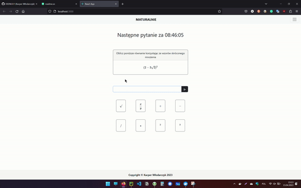

# MATURALNIE
### This project allows users once per day to calculate the math problem. 

### Every day the question is drawn from the database based on current datetime 

At first, the algorithm takes the current date from the server, and then converts it to hash using Python's built-in hashlib, then the database returns a number of all question items and the code returns the ID of today's question. \
ID is a result of this calculation 
```bash
current_date_time % all_available_questions == ID 
```
Endpoints have a Token authentication and it's only generated for the admin users. A normal user is unable to create an account. This is just a simple security solution.




## Endpoints in the backend application 

 


## Project is based on technologies such as:
- Python
- FastAPI
- React
- Docker


## Installation

```python
# Install requirements 
pip install -r requirements.txt 

# Create a container for backend app 
docker build -t maturalnie-fastapi . 

# run the container 
docker run -d --name mycontainer -p 80:80 maturalnie-fastapi 

# Go to frontend directory 
cd frontend 

# Create a container for frontend app 
docker build -t maturalnie-frontend:latest . 

# run the container 
docker run -d --name mycontainer -p 3000:3000 maturalnie-frontend 
```


## Authors

- [@DEENUU1](https://www.github.com/DEENUU1)

